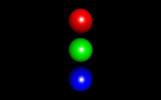
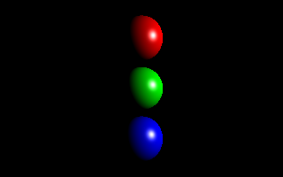

# Raytracer

A basic raytracer built in Python, complete with:
- Ambient, Specular and Diffuse shading
- Reflections
- Rendering Engine

Possible improvements:
- Add Refractions and caustics
- Implement Monte Carlo methods for rendering
- Add different objects, other than spheres
- Add different types of light sources
- Output image in compressed jpg/png files instead of ppm

Some images generated with the above raytracer:

Helpful resources and References:
1. TU Wien Rendering Course - https://users.cg.tuwien.ac.at/zsolnai/gfx/rendering-course/
2. Raytracing in one weekend by Peter Shirley - https://raytracing.github.io/books/RayTracingInOneWeekend.html
